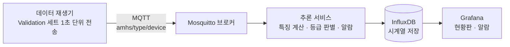

# AMHS 이송장치 실시간 예지보전 모니터링 시스템

> 반도체 팹 물류 이송장치(OHT·AGV)의 1초 단위 센서·열화상 데이터로 **탄화(과열) 위험 등급을 실시간 판별**하고, 40대 이송장치의 상태를 한눈에 보여주는 모니터링 시스템


<!-- 시연 GIF가 준비되면 여기에 추가:  -->

---

## 1. 프로젝트 개요

### 문제 정의
반도체 팹에서 OHT·AGV 같은 이송장치가 멈추면 웨이퍼 이동이 중단되어 생산 전체에 영향을 줍니다. 특히 모터·전장부 과열로 인한 **탄화**는 화재로 이어질 수 있는 안전 문제입니다. 이 프로젝트는 이송장치 내부 센서와 열화상 정보로 위험 징후를 조기에 감지하고, 여러 대의 장치를 실시간으로 모니터링하는 시스템을 구현합니다.

### 목표
- 센서 8종 + 열화상 최고온도로 위험 등급 4단계(정상·관심·경고·위험) 판별
- 순간값이 아닌 **최근 N초의 흐름**으로 판단하는 실시간 추론
- 현장 알람 피로도를 고려한 **알람 정책** 설계
- 저장 데이터를 실시간처럼 재생하는 **모니터링 시스템** 구현 (MQTT → InfluxDB → Grafana)

### 핵심 결과
<!-- 모델·시스템 완성 후 채우기 -->
| 항목 | 결과 |
|---|---|
| 위험 등급 재현율 | TBD |
| Macro F1 (기준선 0.68) | TBD |
| 평균 조기 감지 시간 | TBD |
| 1건당 추론 시간 | TBD |

---

## 2. 시스템 아키텍처



| 구성요소 | 역할 | 기술 |
|---|---|---|
| 데이터 재생기 | 모델이 학습하지 않은 Validation 데이터를 장치별로 1초 간격 전송 (배속 지원) | Python, paho-mqtt |
| 메시지 브로커 | 장치별 토픽으로 데이터 전달 | Mosquitto |
| 추론 서비스 | 최근 N초 버퍼로 특징 계산 → ONNX 모델 판별 → 알람 규칙 적용 | Python, onnxruntime |
| 저장소 | 센서값·예측 등급·정답·알람 이벤트 저장 | InfluxDB |
| 대시보드 | 40대 상태 현황판, 장치별 추이, 알람 로그 | Grafana |

> 8주차 MVP는 위 흐름을 Streamlit 앱 하나로 구현한 버전입니다 (`app_mvp/`).

---

## 3. 데이터

**AI Hub 「제조현장 이송장치의 열화 예지보전 멀티모달 데이터」**

| 항목 | 내용 |
|---|---|
| 대상 | OHT 20대, AGV 20대 (테스트베드) |
| 규모 | 1차 개방 13,121세트 (OHT 5,948 / AGV 7,173) |
| 1세트 | 1초 측정값 = 센서 CSV + 열화상 BIN + 라벨 JSON |
| 센서 | NTC(온도), PM1.0·PM2.5·PM10(미세먼지), CT1~CT4(전류), 열화상 최고온도 |
| 정답 | 0 정상 / 1 관심 / 2 경고 / 3 위험 (위험 약 8%) |

- 원본 데이터는 저장소에 포함하지 않습니다. 다운로드와 준비 방법은 [`data/README.md`](data/README.md)를 참고하세요.
- 같은 장치의 파일을 시간순으로 이으면 1초 간격 시계열이 되어, 실시간 재생에 적합합니다.

---

## 4. 접근 방법

### 4-1. 데이터 통합
라벨 JSON 하나에 센서값·정답·열화상 요약·메타정보가 모두 들어 있어, 수만 개의 파일을 **한 개의 Parquet 테이블**로 통합했습니다.

### 4-2. 실시간 계산 가능한 특징
학습과 실시간 추론이 **같은 함수**(`src/features.py`)를 사용하며, "지금까지 들어온 최근 N초"만으로 계산 가능한 특징만 씁니다.
<!-- 최종 특징 목록과 N 값 기입 -->

### 4-3. 모델
<!-- 베이스라인 → LightGBM → ONNX 경량화 과정과 비교표 기입 -->

### 4-4. 평가 기준
정확도보다 **위험·경고 등급을 놓치지 않는 것**을 우선했습니다.
- 등급별 재현율 (특히 위험 등급)
- 오분류 비용 행렬 (위험을 정상으로 판단하는 오류에 가장 큰 비용)
- 조기 감지 시간: 실제 등급 상승 대비 몇 초 먼저 감지했는지
- 데이터 분할: 장치 단위로 나누어 같은 장치의 데이터가 학습·검증에 섞이지 않도록 함

### 4-5. 알람 정책
<!-- 예: "3초 연속 경고 이상이면 알람 1회, 5초 연속 정상이면 해제" 와 그 근거 -->

---

## 5. 결과
<!-- 성능표, 혼동행렬, SHAP 해석, 시연 영상 링크 -->

---

## 6. 실행 방법

### 사전 준비
```bash
git clone https://github.com/<username>/amhs-realtime-monitoring.git
cd amhs-realtime-monitoring
pip install -r requirements.txt
```
데이터는 [`data/README.md`](data/README.md)에 따라 준비합니다.

### 데이터 통합 → 학습
```bash
python src/build_dataset.py      # JSON → data/processed/aihub.parquet
python src/train.py              # 학습 → models/model.onnx
```

### MVP 실행 (Streamlit)
```bash
streamlit run app_mvp/dashboard.py
```

### 전체 시스템 실행 (Docker)
```bash
docker compose up
# Grafana: http://localhost:3000
```

---

## 7. 프로젝트 구조
```
amhs-realtime-monitoring/
├── data/                 # 원본·가공 데이터 (git 제외), 준비 방법은 data/README.md
├── notebooks/            # 데이터 확인, EDA, 모델 실험
├── src/                  # 데이터 통합, 특징, 학습, 평가, 알람 (학습·실시간 공용)
├── app_mvp/              # Streamlit MVP
├── services/             # replayer, inference, grafana, mosquitto
├── models/               # 학습된 모델 (ONNX)
├── reports/figures/      # README용 그래프
├── docker-compose.yml
└── requirements.txt
```

---

## 8. 한계와 개선 방향
- 등급별 데이터는 테스트베드의 **모사 시스템**에서 수집되어, 실제 현장 열화 패턴과 차이가 있을 수 있습니다.
- 1차 개방분(전체의 약 10.6%)만 사용했습니다.
- 실시간 시스템은 실제 센서가 아닌 **저장 데이터 재생** 방식으로 검증했습니다.
- 개선 방향: 실제 현장 데이터로 재검증, 원본 열화상 이미지 활용, 장치 간 편차를 고려한 개인화 임계값, 엣지 디바이스 탑재 검증
<!-- 진행하며 추가 -->

---

## 9. 진행 현황

| 단계 | 기간 | 상태 |
|---|---|---|
| 데이터 준비·검증·EDA | 1~3주차 | ⏳ |
| 특징·모델·알람 정책·경량화 | 4~7주차 | ⬜ |
| Streamlit MVP | 8주차 | ⬜ |
| MQTT·InfluxDB·Grafana·Docker | 9~11주차 | ⬜ |
| 문서화 | 12주차 | ⬜ |

---

## 데이터 출처
본 프로젝트는 과학기술정보통신부의 재원으로 한국지능정보사회진흥원의 지원을 받아 구축된 「제조현장 이송장치의 열화 예지보전 멀티모달 데이터」를 활용하였습니다. 데이터는 AI Hub(https://www.aihub.or.kr)에서 제공받았습니다.
