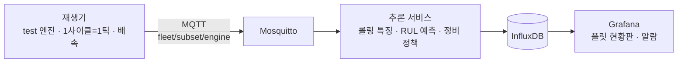

# Fleet RUL Monitoring — 다수 장비 잔여수명 실시간 모니터링 시스템

> NASA C-MAPSS 터보팬 엔진 데이터로 **여러 대 장비의 잔여수명(RUL)을 예측하고, 실시간으로 감시하며 정비 우선순위를 제시하는** 모니터링 시스템


<!-- 시연 GIF 준비되면 추가:  -->

---

## 1. 프로젝트 개요

### 문제 정의
반도체 팹의 OHT, 물류 창고의 AGV, 항공기 엔진처럼 **같은 종류의 장비 수백 대를 동시에 운영하는 현장**에서는, 장비 한 대의 상태를 정밀하게 보는 것만큼 "지금 어느 장비를 먼저 정비해야 하는가"를 판단하는 것이 중요합니다. 이 프로젝트는 운전 데이터로 각 장비의 잔여수명을 예측하고, 이를 실시간 관제 화면과 정비 우선순위로 연결하는 시스템을 구현합니다.

### 이 데이터를 쓴 이유
C-MAPSS는 수백 대의 엔진이 각자 다른 초기 상태에서 열화되어 고장에 이르는 데이터입니다. **다수 장비 플릿을 관제하는 구조**를 검증하기에 적합하고, 구조가 단순해 모델링보다 시스템 설계와 운영 관점에 집중할 수 있습니다. 여기서 만든 구조는 센서 구성만 바꾸면 다른 설비에도 적용할 수 있습니다.

### 목표
- 장비별 잔여수명(RUL) 예측과 **불확실성(예측 구간)** 표현
- 늦은 예측에 더 큰 벌점을 주는 **비대칭 평가**와 정비 비용 관점 해석
- 저장 데이터를 사이클 단위로 재생하는 **실시간 파이프라인** (MQTT → InfluxDB → Grafana)
- 수십~수백 대를 한눈에 보는 **플릿 현황판**과 **정비 우선순위 큐**

### 핵심 결과
<!-- 모델·시스템 완성 후 채우기 -->
| 항목 | 결과 |
|---|---|
| RMSE (테스트) | TBD |
| PHM 비대칭 점수 | TBD |
| 평균 조기 감지 시점 | TBD |
| 1건당 추론 시간 | TBD |

---

## 2. 시스템 아키텍처



| 구성요소 | 역할 |
|---|---|
| 재생기 | 모델이 학습하지 않은 test 엔진을 사이클 단위로 전송 (배속 조절) |
| 브로커 | 엔진별 토픽으로 메시지 전달 (Mosquitto) |
| 추론 서비스 | 엔진별 최근 N사이클 버퍼 → 특징 계산 → RUL 예측 → 알람·우선순위 판정 |
| 저장소 | 센서값, 예측 RUL, 정답, 알람 이벤트 저장 (InfluxDB) |
| 대시보드 | 플릿 타일 현황, 엔진별 RUL 추이, 정비 우선순위 큐 (Grafana) |

> 8주차 MVP는 위 흐름을 Streamlit 앱 하나로 구현한 버전입니다 (`app_mvp/`).

---

## 3. 데이터

**NASA C-MAPSS Turbofan Engine Degradation Simulation Data Set**

- 엔진별 운전 사이클마다 운전조건 3개와 센서 21개를 기록한 시뮬레이션 데이터
- 하위셋 4종(FD001~FD004)이 운전조건 수와 고장 모드 수에 따라 난이도가 다름
- `train`은 고장까지의 전체 이력, `test`는 고장 전 임의 시점에서 잘려 있고, 정답 파일에 각 엔진의 **마지막 시점 잔여수명**이 주어짐

원본 데이터는 저장소에 포함하지 않습니다. 다운로드와 준비 방법은 [`data/README.md`](data/README.md)를 참고하세요.

---

## 4. 접근 방법
<!-- 진행하며 채우기. 지금은 계획이며 데이터 확인 후 변경될 수 있음 -->

### 4-1. RUL 라벨링
엔진 초기 구간은 열화가 거의 없어 잔여수명을 그대로 쓰면 모델이 초반 예측에 과도하게 끌려갑니다. 상한값을 두는 방식과 그 근거를 기록합니다. *(3주차 결정)*

### 4-2. 실시간 계산 가능한 특징
학습과 실시간 추론이 **같은 함수**(`src/features.py`)를 사용하며, "지금까지 들어온 최근 N사이클"만으로 계산 가능한 특징만 사용합니다. 미래 정보를 쓰는 특징은 실시간에서 재현할 수 없으므로 배제합니다.

### 4-3. 모델
베이스라인(평균 예측, 선형회귀) → LightGBM → 시퀀스 모델 순으로 비교합니다. *(4~6주차)*

### 4-4. 평가
- RMSE와 함께 **늦은 예측에 더 큰 벌점을 주는 비대칭 점수** 사용
- 정비 비용 관점 해석: 조기 교체 낭비 vs 고장 발생 손실
- 분할: 같은 엔진의 사이클이 학습과 검증에 섞이지 않도록 **엔진 단위 분할**

### 4-5. 운영 정책
알람 기준, 연속 N사이클 규칙, "하루 N대만 정비 가능" 제약을 반영한 정비 우선순위 큐. *(7주차)*

---

## 5. 결과
<!-- 성능표, 예측 vs 실제 그래프, 드리프트 실험, 시연 영상 -->

---

## 6. 실행 방법

```bash
git clone https://github.com/<username>/fleet-rul-monitoring.git
cd fleet-rul-monitoring
pip install -r requirements.txt
```
데이터는 [`data/README.md`](data/README.md)에 따라 준비합니다.

```bash
python src/load.py        # 원본 txt → data/processed/cmapss.parquet
python src/train.py       # 학습 → models/
streamlit run app_mvp/dashboard.py     # MVP 실행
docker compose up                      # 전체 시스템 (Grafana: localhost:3000)
```

---

## 7. 프로젝트 구조
```
fleet-rul-monitoring/
├── data/            # 원본·가공 데이터 (git 제외), 준비 방법은 data/README.md
├── notebooks/       # 구조 확인, EDA, 라벨링, 모델 실험
├── src/             # load, labeling, features, train, evaluate, policy
├── app_mvp/         # Streamlit MVP
├── services/        # replayer, inference, grafana, mosquitto
├── models/
├── reports/figures/
├── docker-compose.yml
└── requirements.txt
```

---

## 8. 한계와 개선 방향
- C-MAPSS는 **시뮬레이션 데이터**로, 실제 센서의 결측·노이즈·드리프트가 단순화되어 있습니다.
- 실시간 시스템은 실제 장비가 아닌 **저장 데이터 재생** 방식으로 검증했습니다.
- 개선 방향: 실제 설비 데이터로 재검증, 운전조건 변화에 대한 적응, 엣지 환경 추론 최적화
<!-- 진행하며 추가 -->

---

## 9. 진행 현황

| 단계 | 기간 | 상태 |
|---|---|---|
| 개념 학습 · 데이터 구조 확인 | 1주차 | ⏳ |
| EDA | 2주차 | ⬜ |
| 설계 확정 (중간 점검) | 3주차 | ⬜ |
| 베이스라인 · 모델 · 정책 | 4~7주차 | ⬜ |
| Streamlit MVP | 8주차 | ⬜ |
| MQTT · InfluxDB · Grafana · Docker | 9~11주차 | ⬜ |
| 문서화 | 12주차 | ⬜ |

> 1~3주차는 탐색 구간으로, 데이터 확인 결과에 따라 이후 계획이 조정될 수 있습니다.

---

## 데이터 출처
A. Saxena and K. Goebel (2008). *Turbofan Engine Degradation Simulation Data Set*, NASA Prognostics Center of Excellence (PCoE) Data Set Repository, NASA Ames Research Center.
